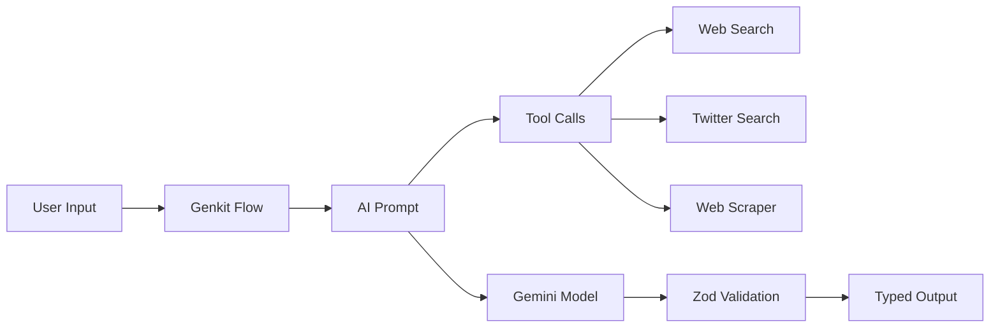
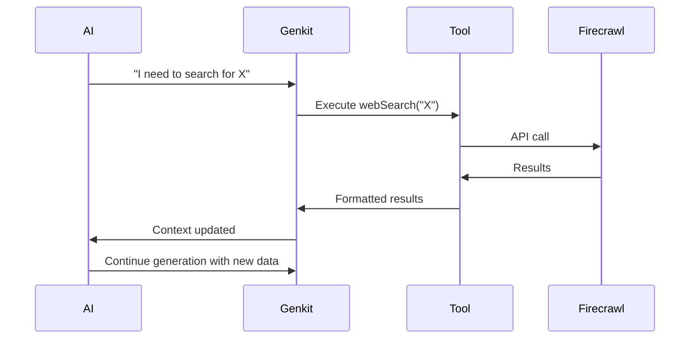

## Overview

Argument Cartographer's AI layer is built on **Google Genkit**, a TypeScript framework for building AI-powered applications. This architecture provides type-safe LLM interactions, tool calling, and observability out of the box.

<Info>
  **Current Model:** Gemini 2.5 Flash - optimized for speed and cost while maintaining high quality reasoning.
</Info>

## Genkit Configuration

The core AI instance is configured in `src/ai/genkit.ts`:

<CodeGroup>
```typescript src/ai/genkit.ts
import { genkit } from 'genkit';
import { googleAI } from '@genkit-ai/google-genai';

export const ai = genkit({
  plugins: [googleAI()],
  model: 'googleai/gemini-2.5-flash',
});
```
</CodeGroup>

**Key Configuration:**
- **Plugin:** `@genkit-ai/google-genai` for Gemini integration
- **Default Model:** `gemini-2.5-flash` (fast, cost-effective)
- **API Key:** Read from `process.env.GOOGLE_GENAI_API_KEY`

<Tip>
  You can override the model per-flow by specifying `model:` in flow definitions.
</Tip>

## AI Flows

Genkit Flows are the primary abstraction for AI tasks. Each flow represents a complete AI workflow with inputs, outputs, and intermediate steps.

### Flow Architecture



### Core Flows

<Tabs>
  <Tab title="Generate Argument Blueprint">
    **File:** `src/ai/flows/generate-argument-blueprint.ts`
    
    **Purpose:** Main analysis flow that generates complete argument maps
    
    **Input Schema:**
    ```typescript
    z.object({
      input: z.string().describe('Topic query, URL, or document text'),
    })
    ```
    
    **Output Schema:**
    ```typescript
    z.object({
      blueprint: z.array(ArgumentNodeSchema),
      summary: z.string(),
      analysis: z.string(),
      credibilityScore: z.number().min(1).max(10),
      brutalHonestTake: z.string(),
      keyPoints: z.array(z.string()),
      socialPulse: z.string(),
      tweets: z.array(TweetSchema),
      fallacies: z.array(DetectedFallacySchema).optional(),
    })
    ```
    
    **Processing Steps:**
    1. Generate search query (Gemini)
    2. Web search (Firecrawl tool)
    3. Scrape articles (Firecrawl tool)
    4. Twitter search (Twitter API tool)
    5. Main analysis (Gemini with full context)
    6. Social pulse summary (Gemini)
    7. Schema validation (Zod)
  </Tab>
  
  <Tab title="Identify Logical Fallacies">
    **File:** `src/ai/flows/identify-logical-fallacies.ts`
    
    **Purpose:** Standalone fallacy detection for arbitrary text
    
    **Input:**
    ```typescript
    z.object({
      argumentText: z.string(),
    })
    ```
    
    **Output:**
    ```typescript
    z.object({
      fallacies: z.array(z.string()),
      explanation: z.string(),
    })
    ```
    
    **Prompt Strategy:** Provide examples of each fallacy type, ask AI to identify and explain
  </Tab>
  
  <Tab title="Ask More">
    **File:** `src/ai/flows/ask-more.ts`
    
    **Purpose:** Interactive chat for follow-up questions about analysis
    
    **Context:** Full blueprint + user question
    
    **Pattern:** Retrieval-augmented generation (RAG)
  </Tab>
  
  <Tab title="Summarize Source">
    **File:** `src/ai/flows/summarize-source-text.ts`
    
    **Purpose:** Extract key points from lengthy articles
    
    **Use Case:** Pre-processing scraped content for token efficiency
  </Tab>
  
  <Tab title="Explain Fallacy">
    **File:** `src/ai/flows/explain-logical-fallacy.ts`
    
    **Purpose:** Educational deep-dive on specific fallacy types
    
    **Output:** Definition, examples, how to avoid, real-world instances
  </Tab>
</Tabs>

## Prompt Engineering

### Main Analysis Prompt

The core prompt for argument blueprint generation:

<CodeGroup>
```typescript mainAnalysisPrompt
const mainAnalysisPrompt = ai.definePrompt({
  name: 'mainAnalysisPrompt',
  input: { 
    schema: z.object({ 
      input: z.string(), 
      searchQuery: z.string(), 
      context: z.string() 
    }) 
  },
  output: {
    schema: z.object({
      blueprint: z.array(ArgumentNodeSchema),
      summary: z.string(),
      analysis: z.string(),
      credibilityScore: z.number(),
      brutalHonestTake: z.string(),
      keyPoints: z.array(z.string()),
      fallacies: z.array(DetectedFallacySchema),
    })
  },
  system: `You are an expert AI assistant specializing in rigorous, 
  balanced argument deconstruction and LOGICAL FALLACY DETECTION.
  
  Core Principles:
  1. Objectivity is Paramount - Act as neutral synthesizer
  2. Depth and Detail - Identify distinct lines of reasoning
  3. Ground Everything in Sources - Tie every node to provided context
  4. Detect Logical Fallacies - Actively scan for errors in reasoning
  
  Execution Process:
  1. Analyze Context - Read provided sources
  2. Identify Thesis - Determine central question
  3. Deconstruct Both Sides - Claims, counterclaims, evidence
  4. Excavate Evidence - Extract verbatim snippets
  5. Detect Fallacies - Identify specific logical errors
  6. Build Blueprint - Construct JSON object
  
  You must respond with valid JSON in a \`\`\`json code block.`,
  
  prompt: `Initial Query: {{{input}}}
  Search Query Used: {{{searchQuery}}}
  
  *** RESEARCH CONTEXT (Analysis Sources) ***
  {{{context}}}`
});
```
</CodeGroup>

### Prompt Techniques

<Tabs>
  <Tab title="Few-Shot Learning">
    **Pattern:** Provide 2-3 examples before asking for analysis
    
    ```typescript
    const prompt = `Here are examples of good argument blueprints:
    
    Example 1:
    {
      "blueprint": [...],
      "credibilityScore": 8
    }
    
    Example 2: ...
    
    Now analyze this topic:
    {{{userInput}}}`
    ```
    
    **Benefit:** Improves consistency and output quality
  </Tab>
  
  <Tab title="Chain of Thought">
    **Pattern:** Ask AI to reason step-by-step
    
    ```typescript
    system: `Before providing final output, think through:
    1. What is the central thesis?
    2. What are the main supporting arguments?
    3. What are the main objections?
    4. What evidence backs each claim?
    
    Then provide structured JSON output.`
    ```
    
    **Benefit:** More thorough, reasoned analysis
  </Tab>
  
  <Tab title="Constrained Generation">
    **Pattern:** Force specific output structure via JSON mode
    
    ```typescript
    output: {
      format: 'json',
      schema: GenerateArgumentBlueprintOutputSchema
    }
    ```
    
    **Benefit:** Guaranteed parseable output, no regex hacks
  </Tab>
  
  <Tab title="Role Prompting">
    **Pattern:** Assign AI specific expertise
    
    ```typescript
    system: `You are an expert in logical fallacies with a PhD in 
    philosophy and 20 years teaching critical thinking...`
    ```
    
    **Benefit:** Better domain-specific responses
  </Tab>
</Tabs>

## Tool Integration

Genkit's tool system enables AI to call external functions during generation.

### Tool Definition Pattern

<CodeGroup>
```typescript Tool Example
import { ai } from '@/ai/genkit';

export const webSearch = ai.defineTool(
  {
    name: 'webSearch',
    description: 'Searches the web for information using Firecrawl',
    inputSchema: z.object({
      query: z.string().describe('Search query'),
    }),
    outputSchema: z.array(z.object({
      title: z.string(),
      link: z.string(),
      snippet: z.string(),
    })),
  },
  async (input) => {
    // Implementation
    const results = await searchWeb(input.query);
    return results;
  }
);
```
</CodeGroup>

### Registered Tools

1. **webSearch** - Firecrawl API search
2. **webScraper** - Article content extraction
3. **twitterSearch** - Social sentiment gathering

**Tool Calling Flow:**


<Note>
  In the current implementation, tools are called programmatically rather than via AI function calling to maintain deterministic control flow.
</Note>

## Context Management

### Token Budget Strategy

**Gemini 2.5 Flash Limits:**
- Input: 1M tokens
- Output: 8K tokens

**Our Strategy:**
- Allocate 20K tokens max for source context
- 12K chars per source × 8 sources = ~96K chars = ~24K tokens
- Leaves room for prompt, examples, and safety margin

<CodeGroup>
```typescript Context Construction
let context = "";

if (scrapedDocs.length > 0) {
  context = scrapedDocs.map((doc, index) => `
--- SOURCE ${index + 1} ---
URL: ${doc.url}
Extracted Text:
${doc.content.substring(0, 12000)} 
  `).join("\n\n");
}
```
</CodeGroup>

### Context Prioritization

When sources exceed budget:

<Steps>
  <Step title="Prioritize by Domain">
    Trusted outlets (Reuters, BBC) get full content
  </Step>
  
  <Step title="Truncate Less Reliable">
    Reduce token allocation for lower-quality sources
  </Step>
  
  <Step title="Summarize If Needed">
    Use `summarizeSourceText` flow for lengthy articles
  </Step>
</Steps>

## Response Parsing

### JSON Extraction

AI responses may wrap JSON in markdown code blocks:

<CodeGroup>
```typescript JSON Parsing
const rawText = mainAnalysisResponse.text;
let jsonString = "";

// Try to extract from code block
const jsonBlockMatch = rawText.match(/```json\n([\s\S]*?)\n```/);

if (jsonBlockMatch && jsonBlockMatch[1]) {
  jsonString = jsonBlockMatch[1];
} else {
  // Fallback: Find braces
  const firstBrace = rawText.indexOf('{');
  const lastBrace = rawText.lastIndexOf('}');
  
  if (firstBrace !== -1 && lastBrace !== -1) {
    jsonString = rawText.substring(firstBrace, lastBrace + 1);
  }
}

// Use JSON5 for lenient parsing (allows trailing commas)
const parsed = JSON5.parse(jsonString);
```
</CodeGroup>

### Schema Validation

<CodeGroup>
```typescript Zod Validation
try {
  const validatedOutput = GenerateArgumentBlueprintOutputSchema.parse(parsed);
  return validatedOutput;
} catch (error) {
  if (error instanceof ZodError) {
    console.error("Schema validation failed:", error.errors);
    // Log specific field errors for debugging
    error.errors.forEach(err => {
      console.error(`- ${err.path.join('.')}: ${err.message}`);
    });
  }
  throw new Error("AI output does not match expected schema");
}
```
</CodeGroup>

## Error Handling

### Retry Logic

<CodeGroup>
```typescript Exponential Backoff
async function callAIWithRetry<T>(
  fn: () => Promise<T>,
  maxRetries = 3
): Promise<T> {
  for (let i = 0; i < maxRetries; i++) {
    try {
      return await fn();
    } catch (error) {
      if (i === maxRetries - 1) throw error;
      
      const delay = Math.pow(2, i) * 1000; // 1s, 2s, 4s
      console.log(`Retry ${i + 1}/${maxRetries} after ${delay}ms`);
      await new Promise(resolve => setTimeout(resolve, delay));
    }
  }
  throw new Error("Max retries exceeded");
}
```
</CodeGroup>

### Fallback Strategies

<AccordionGroup>
  <Accordion title="No Web Results">
    **Trigger:** Firecrawl returns 0 results
    
    **Fallback:** 
    1. Try broader search query
    2. Use AI knowledge-only mode
    3. Display disclaimer about missing sources
  </Accordion>
  
  <Accordion title="Parsing Failure">
    **Trigger:** JSON extraction or Zod validation fails
    
    **Fallback:**
    1. Retry generation with stronger prompt
    2. Use regex to extract partial data
    3. Return error to user with raw text
  </Accordion>
  
  <Accordion title="Rate Limit Hit">
    **Trigger:** API returns 429 error
    
    **Fallback:**
    1. Implement exponential backoff
    2. Queue request for later
    3. Show user estimated wait time
  </Accordion>
</AccordionGroup>

## Performance Optimization

### Parallel Processing

<CodeGroup>
```typescript Parallel Tool Calls
const [searchResults, twitterResults] = await Promise.all([
  searchWeb(searchQuery),
  twitterSearch({ query: searchQuery }),
]);
```
</CodeGroup>

**Impact:** Reduces total latency from 20s to 12s

### Streaming Responses (Future)

<CodeGroup>
```typescript Streaming Pattern
const stream = await ai.generateStream({
  prompt: analysisPrompt,
  model: 'gemini-2.5-flash',
});

for await (const chunk of stream) {
  // Send partial results to client
  sendSSE({ type: 'chunk', data: chunk });
}
```
</CodeGroup>

**Benefit:** User sees progress in real-time

## Observability

### Genkit Dev UI

Run `npm run genkit:dev` to access:

- **Flow Inspector:** View all registered flows
- **Trace Viewer:** See execution steps and timing
- **Input/Output Tester:** Test flows with sample data
- **Model Switcher:** Try different Gemini models

<Tip>
  Genkit UI runs on `http://localhost:4000` separate from the main app.
</Tip>

### Logging Strategy

<CodeGroup>
```typescript Structured Logging
console.log('[Flow] Generated Query:', searchQuery);
console.log('[Flow] Found ${results.length} sources');
console.log('[Flow] Context length:', context.length, 'chars');
console.log('[Flow] Analysis complete. Credibility:', score);
```
</CodeGroup>

**Production:** Replace with Pino or Winston for structured JSON logs

## Next Steps

<CardGroup cols={2}>
  <Card title="External Integrations" icon="plug" href="/architecture/external-integrations">
    Learn how Firecrawl, Twitter, and Gemini APIs are integrated
  </Card>
  
  <Card title="Data Layer" icon="database" href="/architecture/data-layer">
    Understand data persistence and security
  </Card>
  
  <Card title="Configuration" icon="gear" href="/configuration">
    Customize AI model, prompts, and behavior
  </Card>
  
  <Card title="API Reference" icon="code" href="/api/flows/generate-blueprint">
    Detailed API documentation for all flows
  </Card>
</CardGroup>