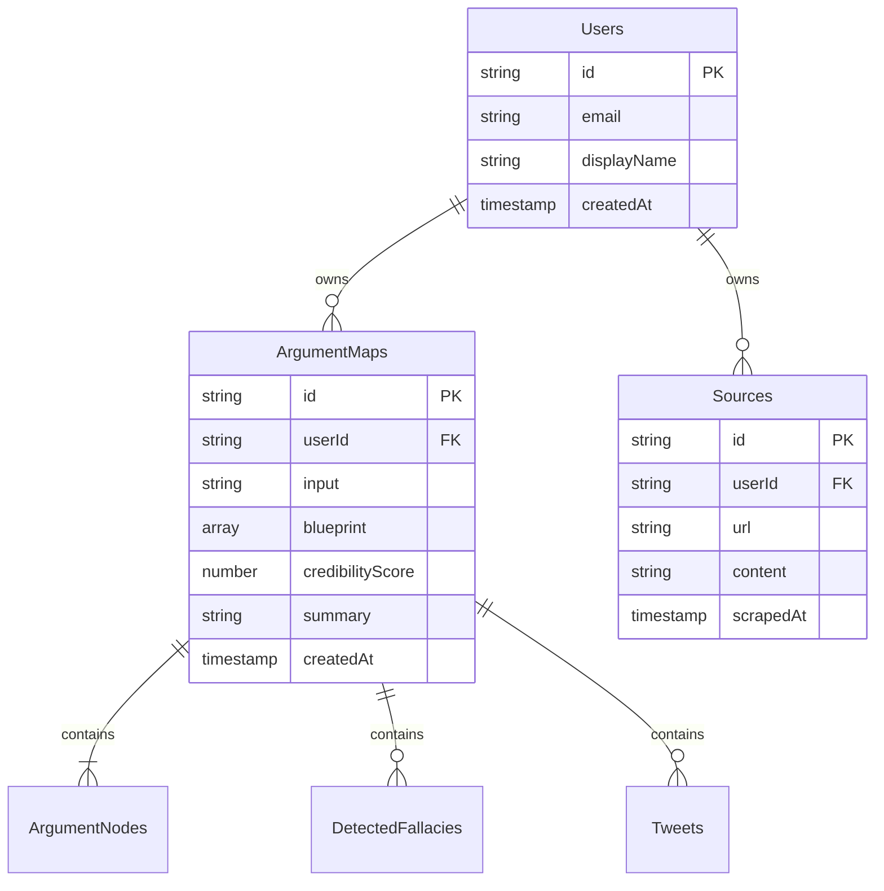

## Overview

Argument Cartographer uses **Firebase Firestore** as its primary database, chosen for rapid development, built-in security, real-time capabilities, and managed scaling. The data model follows a strict user-ownership pattern for privacy and security.

<Info>
  **Security Model:** All user data is isolated under `/users/{userId}` paths with declarative Firestore Security Rules preventing cross-user access.
</Info>

## Data Architecture



## Collection Structure

### Root Collections

<Tabs>
  <Tab title="/users">
    **Purpose:** User profile documents
    
    **Path:** `/users/{userId}`
    
    **Schema:**
    ```typescript
    interface UserProfile {
      id: string;                // Matches doc ID
      email: string;             // From Firebase Auth
      displayName: string | null;
      photoURL: string | null;
      createdAt: Timestamp;
      updatedAt: Timestamp;
    }
    ```
    
    **Access Control:**
    - **Read:** Owner only
    - **Write:** Owner only
    - **List:** Disabled (prevents user enumeration)
    
    **Example:**
    ```json
    /users/abc123xyz {
      "id": "abc123xyz",
      "email": "user@example.com",
      "displayName": "Jane Doe",
      "createdAt": "2024-03-01T10:00:00Z"
    }
    ```
  </Tab>
  
  <Tab title="/radarTopics">
    **Purpose:** Pre-analyzed public topics (Narrative Radar)
    
    **Path:** `/radarTopics/{topicId}`
    
    **Schema:**
    ```typescript
    interface RadarTopic {
      id: string;
      title: string;
      description: string;
      thumbnail: string;         // Image URL
      categories: string[];      // ["Technology", "Ethics"]
      
      // Analysis data
      blueprint: ArgumentNode[];
      credibilityScore: number;
      fallacies: DetectedFallacy[];
      tweets: Tweet[];
      socialPulse: string;
      
      // Metadata
      sourceCount: number;
      fallacyCount: number;
      featured: boolean;
      archived: boolean;
      
      createdAt: Timestamp;
      updatedAt: Timestamp;
    }
    ```
    
    **Access Control:**
    - **Read:** Public (all users)
    - **Write:** Admin only (server-side)
    - **List:** Public with pagination
  </Tab>
</Tabs>

### Subcollections

<Tabs>
  <Tab title="argumentMaps">
    **Purpose:** User's saved argument analyses
    
    **Path:** `/users/{userId}/argumentMaps/{mapId}`
    
    **Schema:**
    ```typescript
    interface ArgumentMap {
      id: string;
      userId: string;            // Denormalized for queries
      
      // Input
      input: string;             // Original query/URL/text
      
      // Analysis Results
      blueprint: ArgumentNode[];
      summary: string;
      analysis: string;
      credibilityScore: number;
      brutalHonestTake: string;
      keyPoints: string[];
      
      // Social Data
      socialPulse: string;
      tweets: Tweet[];
      
      // Fallacies
      fallacies: DetectedFallacy[];
      
      // Metadata
      createdAt: Timestamp;
      updatedAt: Timestamp;
    }
    ```
    
    **Indexes:**
    - `(userId, createdAt DESC)` - For history queries
    
    **Access Control:**
    - **Read:** Owner only
    - **Write:** Owner only
    - **List:** Owner can list their own
  </Tab>
  
  <Tab title="sources">
    **Purpose:** Cached scraped sources (optimization)
    
    **Path:** `/users/{userId}/sources/{sourceId}`
    
    **Schema:**
    ```typescript
    interface Source {
      id: string;                // Hash of URL
      userId: string;
      url: string;
      content: string;           // Markdown content
      scrapedAt: Timestamp;
      
      // Optional metadata
      title?: string;
      author?: string;
      publishedAt?: Timestamp;
    }
    ```
    
    **Caching Strategy:**
    - Cache for 7 days
    - Reuse if scraped recently
    - Reduces Firecrawl API costs
    
    **Access Control:**
    - **Read:** Owner only
    - **Write:** Owner only
  </Tab>
</Tabs>

## Nested Data Structures

### ArgumentNode

<CodeGroup>
```typescript ArgumentNode Schema
interface ArgumentNode {
  id: string;                   // Unique within blueprint
  parentId: string | null;      // null for thesis
  type: 'thesis' | 'claim' | 'counterclaim' | 'evidence';
  side: 'for' | 'against';
  content: string;              // The argument text
  sourceText: string;           // Verbatim quote from source
  source: string;               // URL
  fallacies: string[];          // Array of fallacy IDs
  logicalRole: string;          // "Primary evidence", etc.
}
```
</CodeGroup>

**Storage:** Embedded array within `argumentMaps.blueprint`

**Why not separate collection?**
- Tight coupling with analysis
- Always fetched together
- Simpler queries
- Atomic updates

### DetectedFallacy

<CodeGroup>
```typescript DetectedFallacy Schema
interface DetectedFallacy {
  id: string;
  name: string;                 // "Ad Hominem"
  severity: 'Critical' | 'Major' | 'Minor';
  category: string;             // "Logical", "Rhetorical"
  confidence: number;           // 0-1
  problematicText: string;      // Exact quote
  explanation: string;
  definition: string;
  avoidance: string;
  example: string;
  suggestion: string;
  location?: string;            // Which node (optional)
}
```
</CodeGroup>

**Storage:** Embedded array within `argumentMaps.fallacies`

### Tweet

<CodeGroup>
```typescript Tweet Schema
interface Tweet {
  id: string;                   // Twitter tweet ID
  text: string;
  author: {
    name: string;
    username: string;
    profile_image_url: string;
  };
  created_at: string;           // ISO 8601
  public_metrics: {
    retweet_count: number;
    reply_count: number;
    like_count: number;
    impression_count: number;
  };
}
```
</CodeGroup>

**Storage:** Embedded array within `argumentMaps.tweets`

## Firestore Security Rules

Declarative access control enforced at the database level.

### Core Rules File

<CodeGroup>
```javascript firestore.rules
rules_version = '2';
service cloud.firestore {
  match /databases/{database}/documents {
    
    // Helper functions
    function isSignedIn() {
      return request.auth != null;
    }
    
    function isOwner(userId) {
      return isSignedIn() && request.auth.uid == userId;
    }
    
    function isExistingOwner(userId) {
      return isOwner(userId) && resource != null;
    }
    
    // User profiles
    match /users/{userId} {
      allow get: if isOwner(userId);
      allow list: if false;  // No user enumeration
      allow create: if isOwner(userId) && 
                       request.resource.data.id == userId;
      allow update: if isExistingOwner(userId) && 
                       request.resource.data.id == resource.data.id;
      allow delete: if isExistingOwner(userId);
    }
    
    // Argument maps (private)
    match /users/{userId}/argumentMaps/{mapId} {
      allow get, list: if isOwner(userId);
      allow create: if isOwner(userId) && 
                       request.resource.data.userId == userId;
      allow update, delete: if isExistingOwner(userId);
    }
    
    // Sources (private cache)
    match /users/{userId}/sources/{sourceId} {
      allow get, list: if isOwner(userId);
      allow create: if isOwner(userId) && 
                       request.resource.data.userId == userId;
      allow update, delete: if isExistingOwner(userId);
    }
    
    // Radar topics (public read, admin write)
    match /radarTopics/{topicId} {
      allow read: if true;  // Public
      allow write: if false;  // Server-side only
    }
  }
}
```
</CodeGroup>

### Security Principles

<Steps>
  <Step title="Default Deny">
    All operations denied unless explicitly allowed
  </Step>
  
  <Step title="Path-Based Authorization">
    Ownership determined by `{userId}` in path - fast, secure
  </Step>
  
  <Step title="No Public Data">
    User data never readable by other users
  </Step>
  
  <Step title="Immutable IDs">
    User IDs and document IDs cannot be changed after creation
  </Step>
  
  <Step title="No Cross-User Queries">
    Impossible to query other users' data even with malicious client
  </Step>
</Steps>

<Warning>
  **Never bypass security rules from server-side code!** Even with Firebase Admin SDK, respect the security model for consistency.
</Warning>

## Query Patterns

### User's Analysis History

<CodeGroup>
```typescript History Query
import { collection, query, where, orderBy, limit, getDocs } from 'firebase/firestore';

const getAnalysisHistory = async (userId: string, limitCount = 20) => {
  const ref = collection(db, `users/${userId}/argumentMaps`);
  const q = query(
    ref,
    orderBy('createdAt', 'desc'),
    limit(limitCount)
  );
  
  const snapshot = await getDocs(q);
  return snapshot.docs.map(doc => ({
    id: doc.id,
    ...doc.data()
  }));
};
```
</CodeGroup>

**Index Required:** `(userId, createdAt DESC)`

### Radar Topic Feed

<CodeGroup>
```typescript Radar Query
const getRadarTopics = async (category?: string) => {
  const ref = collection(db, 'radarTopics');
  const constraints = [
    where('archived', '==', false),
    orderBy('updatedAt', 'desc'),
    limit(50)
  ];
  
  if (category) {
    constraints.unshift(where('categories', 'array-contains', category));
  }
  
  const q = query(ref, ...constraints);
  const snapshot = await getDocs(q);
  return snapshot.docs.map(doc => doc.data());
};
```
</CodeGroup>

**Composite Index:** `(archived, categories, updatedAt DESC)`

### Real-Time Listeners (Future)

<CodeGroup>
```typescript Real-Time Subscription
import { onSnapshot } from 'firebase/firestore';

const subscribeToAnalysis = (userId: string, mapId: string, callback) => {
  const ref = doc(db, `users/${userId}/argumentMaps/${mapId}`);
  
  return onSnapshot(ref, (snapshot) => {
    if (snapshot.exists()) {
      callback(snapshot.data());
    }
  });
};

// Usage
const unsubscribe = subscribeToAnalysis(userId, mapId, (data) => {
  console.log('Analysis updated:', data);
});

// Cleanup
unsubscribe();
```
</CodeGroup>

## Data Lifecycle

### Creation Flow

<Steps>
  <Step title="User Submits Analysis">
    Client sends request via Server Action
  </Step>
  
  <Step title="Server Processes">
    Genkit flow generates complete analysis
  </Step>
  
  <Step title="Firestore Write">
    Server Action saves to `/users/{userId}/argumentMaps/{autoId}`
    
    ```typescript
    const docRef = await addDoc(
      collection(db, `users/${userId}/argumentMaps`),
      {
        ...analysisResult,
        userId,
        createdAt: serverTimestamp(),
      }
    );
    ```
  </Step>
  
  <Step title="Return to Client">
    Document ID and data returned to client for display
  </Step>
</Steps>

### Update Flow (Future)

Re-analyze existing topic with fresh data:

<CodeGroup>
```typescript Update Existing
const refreshAnalysis = async (userId: string, mapId: string) => {
  // Re-run analysis flow
  const freshResult = await generateArgumentBlueprint({ 
    input: existingAnalysis.input 
  });
  
  // Update document
  await updateDoc(
    doc(db, `users/${userId}/argumentMaps/${mapId}`),
    {
      ...freshResult,
      updatedAt: serverTimestamp(),
    }
  );
};
```
</CodeGroup>

### Deletion Policy

<Tabs>
  <Tab title="User-Initiated">
    Users can delete their analyses:
    
    ```typescript
    await deleteDoc(doc(db, `users/${userId}/argumentMaps/${mapId}`));
    ```
    
    **Cascade:** Sources are NOT deleted (may be reused)
  </Tab>
  
  <Tab title="Auto-Expiration (Future)">
    Implement TTL for old analyses:
    
    ```typescript
    // Cloud Function runs daily
    const expireOldAnalyses = async () => {
      const thirtyDaysAgo = Timestamp.fromDate(
        new Date(Date.now() - 30 * 24 * 60 * 60 * 1000)
      );
      
      const q = query(
        collectionGroup(db, 'argumentMaps'),
        where('createdAt', '<', thirtyDaysAgo)
      );
      
      const batch = writeBatch(db);
      const snapshot = await getDocs(q);
      snapshot.docs.forEach(doc => batch.delete(doc.ref));
      await batch.commit();
    };
    ```
  </Tab>
</Tabs>

## Performance Optimization

### Indexing Strategy

**Required Composite Indexes:**

1. **User Analysis History**
   - Collection: `argumentMaps` (collection group)
   - Fields: `userId ASC, createdAt DESC`
   - Query: User history sorted by recency

2. **Radar Feed Filtering**
   - Collection: `radarTopics`
   - Fields: `archived ASC, categories ASC, updatedAt DESC`
   - Query: Active topics by category

3. **Featured Topics**
   - Collection: `radarTopics`
   - Fields: `featured ASC, credibilityScore DESC`
   - Query: Top featured topics

<Tip>
  Firestore will prompt you to create indexes when queries fail. Click the link in the error to auto-generate.
</Tip>

### Denormalization

**Pattern:** Duplicate `userId` in subcollection documents

**Benefit:** Enables collection group queries without joins

<CodeGroup>
```typescript Denormalized userId
// Instead of relying on path alone
/users/{userId}/argumentMaps/{mapId}

// Also store userId in document
{
  "id": "map123",
  "userId": "user456",  // <-- Denormalized
  "blueprint": [...]
}
```
</CodeGroup>

### Batch Operations

Update multiple documents atomically:

<CodeGroup>
```typescript Batch Write
const batch = writeBatch(db);

// Update multiple analyses
analysisIds.forEach(id => {
  const ref = doc(db, `users/${userId}/argumentMaps/${id}`);
  batch.update(ref, { archived: true });
});

await batch.commit(); // Atomic - all or nothing
```
</CodeGroup>

**Limits:** 500 operations per batch

## Cost Optimization

### Read Costs

**Firestore Pricing (as of 2024):**
- **Reads:** $0.06 per 100K
- **Writes:** $0.18 per 100K
- **Deletes:** $0.02 per 100K

**Optimization Strategies:**

1. **Pagination:** Limit queries to 20-50 results
2. **Client Caching:** Cache data in React state/localStorage
3. **Selective Fetching:** Only fetch what's displayed
4. **Real-Time Sparingly:** Use snapshots only when necessary

### Write Costs

Expensive operations:

- Creating analyses (inevitable)
- Updating Radar topics (batched)
- Logging (minimize production logs)

**Tip:** Batch related writes together

## Next Steps

<CardGroup cols={2}>
  <Card title="External Integrations" icon="plug" href="/architecture/external-integrations">
    How external APIs interact with the data layer
  </Card>
  
  <Card title="AI Orchestration" icon="brain" href="/architecture/ai-orchestration">
    How AI generates the data stored in Firestore
  </Card>
  
  <Card title="Installation" icon="download" href="/installation">
    Set up Firebase for your own instance
  </Card>
  
  <Card title="Configuration" icon="gear" href="/configuration">
    Configure Firestore and security rules
  </Card>
</CardGroup>