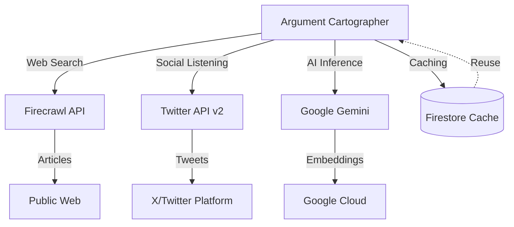

## Overview

Argument Cartographer integrates with three primary external services to gather data and generate intelligence. Each integration follows specific patterns for reliability, cost optimization, and graceful degradation.

<Info>
  **Design Philosophy:** Fail gracefully - if an external API is unavailable, provide degraded but functional service rather than complete failure.
</Info>

## Integration Architecture



## Firecrawl Integration

### Overview

**Service:** [Firecrawl](https://firecrawl.dev)

**Purpose:** Web search and content scraping

**API Version:** v1

**Cost:** 
- Free tier: 500 requests/month
- Pro: $29/mo for 10,000 requests

### Search Endpoint

<CodeGroup>
```typescript Firecrawl Search
const searchWeb = async (query: string) => {
  const firecrawlKey = process.env.FIRECRAWL_API_KEY;
  
  if (!firecrawlKey) {
    throw new Error('Firecrawl API key not configured');
  }
  
  // Build site filter for trusted outlets
  const siteFilter = TRUSTED_NEWS_OUTLETS
    .map(s => `site:${s}`)
    .join(' OR ');
  
  const searchQuery = `${query} (${siteFilter})`;
  
  const response = await fetch('https://api.firecrawl.dev/v1/search', {
    method: 'POST',
    headers: {
      'Authorization': `Bearer ${firecrawlKey}`,
      'Content-Type': 'application/json'
    },
    body: JSON.stringify({
      query: searchQuery,
      limit: 20,
      lang: 'en',
      scrapeOptions: { formats: ['markdown'] }
    })
  });
  
  if (!response.ok) {
    console.warn(`Firecrawl search failed: ${response.status}`);
    // Fallback to general search
    return searchWebGeneral(query, firecrawlKey);
  }
  
  const data = await response.json();
  return (data.data || []).map(item => ({
    title: item.title || 'No title',
    link: item.url,
    snippet: item.description || item.markdown?.substring(0, 600) || '',
  }));
};
```
</CodeGroup>

### Trusted Outlets Filter

**Strategy:** Prioritize quality journalism

<CodeGroup>
```typescript Trusted Sources
const TRUSTED_NEWS_OUTLETS = [
  // Global English News
  "bbc.com",
  "reuters.com",
  "aljazeera.com",
  "apnews.com",
  
  // US Media
  "cnn.com",
  "nytimes.com",
  "washingtonpost.com",
  "theguardian.com",
  
  // Indian Media
  "thehindu.com",
  "indianexpress.com",
  "hindustantimes.com",
  "timesofindia.indiatimes.com",
  "ndtv.com",
  
  // Business
  "bloomberg.com",
  "cnbc.com",
  "economictimes.indiatimes.com",
  
  // Official
  "pib.gov.in",  // Government of India
];
```
</CodeGroup>

**Fallback:** If < 5 results from trusted sources, perform general search

### Scraping Endpoint

<CodeGroup>
```typescript Parallel Scraping
const batchScrapeParallel = async (urls: string[]) => {
  const firecrawlKey = process.env.FIRECRAWL_API_KEY;
  
  const scrapePromises = urls.map(async (url) => {
    try {
      const response = await fetch('https://api.firecrawl.dev/v1/scrape', {
        method: 'POST',
        headers: {
          'Authorization': `Bearer ${firecrawlKey}`,
          'Content-Type': 'application/json'
        },
        body: JSON.stringify({
          url,
          formats: ['markdown'],
          onlyMainContent: true,
        })
      });
      
      if (!response.ok) {
        console.warn(`Failed to scrape ${url}: ${response.status}`);
        return null;
      }
      
      const data = await response.json();
      return {
        url,
        content: data.markdown || '',
        source: url,
      };
    } catch (error) {
      console.error(`Error scraping ${url}:`, error);
      return null;
    }
  });
  
  const results = await Promise.all(scrapePromises);
  return results.filter(r => r !== null && r.content.length > 100);
};
```
</CodeGroup>

### Error Handling

<Tabs>
  <Tab title="Rate Limiting">
    **HTTP 429:** Too Many Requests
    
    **Strategy:**
    ```typescript
    if (response.status === 429) {
      const retryAfter = response.headers.get('Retry-After');
      await sleep(retryAfter ? parseInt(retryAfter) * 1000 : 60000);
      return retry();
    }
    ```
  </Tab>
  
  <Tab title="Quota Exceeded">
    **HTTP 402:** Payment Required (quota exceeded)
    
    **Fallback:**
    ```typescript
    if (response.status === 402) {
      console.warn('Firecrawl quota exceeded');
      // Use AI knowledge-only mode
      return [];
    }
    ```
  </Tab>
  
  <Tab title="Scraping Failure">
    **Website blocks Firecrawl**
    
    **Fallback:**
    ```typescript
    if (scrapedDocs.length === 0) {
      // Use search snippets instead
      context = searchResults.map(r => r.snippet).join('\n\n');
    }
    ```
  </Tab>
</Tabs>

## Twitter API Integration

### Overview

**Service:** Twitter API v2

**Purpose:** Social sentiment and public discourse

**Authentication:** Bearer Token (OAuth 2.0)

**Cost:**
- Free tier: 500,000 tweets/month read
- Basic ($100/mo): 10M tweets/month

### Search Endpoint

<CodeGroup>
```typescript Twitter Search
export const twitterSearch = ai.defineTool(
  {
    name: 'twitterSearch',
    description: 'Search X for recent tweets',
    inputSchema: z.object({
      query: z.string(),
    }),
    outputSchema: z.array(TweetResultSchema),
  },
  async (input) => {
    const bearerToken = process.env.TWITTER_BEARER_TOKEN;
    
    if (!bearerToken) {
      throw new Error('Twitter Bearer Token not configured');
    }
    
    const searchParams = new URLSearchParams({
      'query': `${input.query} lang:en -is:retweet`,
      'tweet.fields': 'created_at,author_id,public_metrics',
      'expansions': 'author_id',
      'user.fields': 'profile_image_url,username,name',
      'max_results': '20',
      'sort_order': 'relevancy',
    });
    
    const response = await fetch(
      `https://api.twitter.com/2/tweets/search/recent?${searchParams}`,
      {
        headers: {
          'Authorization': `Bearer ${bearerToken}`,
        },
      }
    );
    
    if (!response.ok) {
      const errorBody = await response.json();
      console.error('Twitter API error:', errorBody);
      throw new Error(`Twitter API failed: ${errorBody.title}`);
    }
    
    const body = await response.json();
    const tweetsData = body.data || [];
    const usersData = body.includes?.users || [];
    const usersById = new Map(usersData.map(u => [u.id, u]));
    
    return tweetsData.map(tweet => ({
      id: tweet.id,
      text: tweet.text,
      created_at: tweet.created_at,
      public_metrics: tweet.public_metrics,
      author: {
        name: usersById.get(tweet.author_id)?.name || 'Unknown',
        username: usersById.get(tweet.author_id)?.username || 'unknown',
        profile_image_url: usersById.get(tweet.author_id)?.profile_image_url || '',
      },
    }));
  }
);
```
</CodeGroup>

### Query Construction

<Tabs>
  <Tab title="Operators">
    **Language Filter:** `lang:en`
    
    **Exclude Retweets:** `-is:retweet`
    
    **Hashtag:** `#AIregulation` (automatic in query)
    
    **From User:** `from:username` (not currently used)
    
    **Exclude Replies:** `-is:reply` (not currently used)
  </Tab>
  
  <Tab title="Fields">
    **Tweet Fields:**
    - `created_at` - Timestamp
    - `author_id` - User ID
    - `public_metrics` - Engagement stats
    
    **User Fields:**
    - `name` - Display name
    - `username` - @handle
    - `profile_image_url` - Avatar
    
    **Expansions:**
    - `author_id` - Hydrate user objects
  </Tab>
  
  <Tab title="Sorting">
    **Relevancy (default):**
    Twitter's algorithm weighs:
    - Topical relevance to query
    - Engagement (likes, RTs)
    - Recency
    - Author influence
    
    **Recency (alternative):**
    `sort_order: recency` for breaking news
  </Tab>
</Tabs>

### Error Handling

<AccordionGroup>
  <Accordion title="Rate Limit (429)">
    **Limit:** 450 requests per 15-minute window
    
    **Response Headers:**
    ```
    x-rate-limit-limit: 450
    x-rate-limit-remaining: 0
    x-rate-limit-reset: 1678901234
    ```
    
    **Handling:**
    ```typescript
    if (response.status === 429) {
      const resetTime = parseInt(response.headers.get('x-rate-limit-reset'));
      const waitMs = (resetTime * 1000) - Date.now();
      console.log(`Rate limited. Wait ${waitMs}ms`);
      // Don't retry - return empty array
      return [];
    }
    ```
  </Accordion>
  
  <Accordion title="No Results">
    **Scenario:** Topic has no recent tweets
    
    **Response:** `{ data: [] }`
    
    **Handling:**
    ```typescript
    if (tweetsData.length === 0) {
      console.log('No tweets found for query');
      return []; // Empty but valid
    }
    ```
  </Accordion>
  
  <Accordion title="Auth Failure (401)">
    **Cause:** Invalid or missing Bearer Token
    
    **Handling:**
    ```typescript
    if (response.status === 401) {
      console.error('Twitter auth failed - check TWITTER_BEARER_TOKEN');
      throw new Error('Twitter authentication failed');
    }
    ```
  </Accordion>
</AccordionGroup>

## Google Gemini Integration

### Overview

**Service:** Google Gemini API (via Genkit)

**Purpose:** LLM inference for analysis, fallacy detection, summarization

**Model:** `gemini-2.5-flash`

**Cost:**
- Free tier: 15 RPM, 1M tokens/min
- Paid: $0.075 per 1M input tokens, $0.30 per 1M output tokens

### Configuration

<CodeGroup>
```typescript Genkit Setup
import { genkit } from 'genkit';
import { googleAI } from '@genkit-ai/google-genai';

export const ai = genkit({
  plugins: [
    googleAI({
      apiKey: process.env.GOOGLE_GENAI_API_KEY,
    }),
  ],
  model: 'googleai/gemini-2.5-flash',
});
```
</CodeGroup>

### API Calls

<Tabs>
  <Tab title="Simple Generation">
    ```typescript
    const response = await ai.generate({
      prompt: 'Analyze this argument: ...',
      model: 'gemini-2.5-flash',
    });
    
    const text = response.text;
    ```
  </Tab>
  
  <Tab title="Structured Output">
    ```typescript
    const { output } = await prompt({
      input: userQuery,
      searchQuery: generatedQuery,
      context: aggregatedSources,
    });
    
    // Output is type-safe and validated
    const blueprint: ArgumentNode[] = output.blueprint;
    ```
  </Tab>
  
  <Tab title="With System Prompt">
    ```typescript
    const prompt = ai.definePrompt({
      name: 'analysisPrompt',
      system: `You are an expert in argument analysis...`,
      prompt: `Analyze: {{{input}}}`,
      output: {
        schema: OutputSchema
      },
    });
    ```
  </Tab>
</Tabs>

### Rate Limiting

**Free Tier Limits:**
- 15 requests per minute (RPM)
- 1M tokens per minute (TPM)
- 1,500 requests per day (RPD)

**Mitigation:**

<CodeGroup>
```typescript Request Queue
const queue = [];
let inFlight = 0;
const MAX_CONCURRENT = 10;

const queuedGenerate = async (prompt: string) => {
  while (inFlight >= MAX_CONCURRENT) {
    await sleep(100);
  }
  
  inFlight++;
  try {
    return await ai.generate({ prompt });
  } finally {
    inFlight--;
  }
};
```
</CodeGroup>

### Error Handling

<AccordionGroup>
  <Accordion title="Quota Exceeded (429)">
    **Message:** "Resource has been exhausted"
    
    **Handling:**
    ```typescript
    try {
      return await ai.generate({ prompt });
    } catch (error) {
      if (error.message.includes('quota') || error.status === 429) {
        // Wait and retry with exponential backoff
        await sleep(2000 * attempt);
        return retry(attempt + 1);
      }
      throw error;
    }
    ```
  </Accordion>
  
  <Accordion title="Content Filter (400)">
    **Cause:** Input/output triggered safety filter
    
    **Response:** "Blocked by safety filter"
    
    **Handling:**
    ```typescript
    if (error.message.includes('safety')) {
      console.warn('Content flagged by safety filter');
      return {
        blueprint: [],
        summary: 'Analysis blocked by content filter',
        credibilityScore: 0,
      };
    }
    ```
  </Accordion>
  
  <Accordion title="Token Limit (400)">
    **Cause:** Input exceeds 1M tokens
    
    **Handling:**
    ```typescript
    // Truncate context before sending
    const MAX_CONTEXT_CHARS = 80000; // ~20K tokens
    const truncatedContext = context.substring(0, MAX_CONTEXT_CHARS);
    ```
  </Accordion>
</AccordionGroup>

## Integration Resilience

### Graceful Degradation Matrix

| Service Down | Fallback Strategy | User Experience |
|-------------|-------------------|------------------|
| Firecrawl | Use AI knowledge only | "Sources unavailable" disclaimer |
| Twitter | Skip social pulse | No Social Pulse panel shown |
| Gemini | Queue retry, then fail | Error message + retry button |
| Firecrawl + Twitter | AI knowledge mode | Limited but functional analysis |
| All APIs | Hard fail | "Service temporarily unavailable" |

### Health Checks

<CodeGroup>
```typescript API Health Monitor
const checkAPIHealth = async () => {
  const health = {
    firecrawl: false,
    twitter: false,
    gemini: false,
  };
  
  try {
    await fetch('https://api.firecrawl.dev/v1/health');
    health.firecrawl = true;
  } catch {}
  
  try {
    await fetch('https://api.twitter.com/2/tweets/search/recent?query=test', {
      headers: { Authorization: `Bearer ${TWITTER_TOKEN}` },
    });
    health.twitter = true;
  } catch {}
  
  try {
    await ai.generate({ prompt: 'test' });
    health.gemini = true;
  } catch {}
  
  return health;
};
```
</CodeGroup>

## Cost Monitoring

### Usage Tracking

<CodeGroup>
```typescript API Call Counter
let apiCalls = {
  firecrawl: { search: 0, scrape: 0 },
  twitter: { search: 0 },
  gemini: { generate: 0 },
};

const trackCall = (service: string, endpoint: string) => {
  apiCalls[service][endpoint]++;
  
  // Log daily
  if (Date.now() % (24 * 60 * 60 * 1000) < 60000) {
    console.log('Daily API usage:', apiCalls);
    // Reset counters
    apiCalls = {
      firecrawl: { search: 0, scrape: 0 },
      twitter: { search: 0 },
      gemini: { generate: 0 },
    };
  }
};
```
</CodeGroup>

### Cost Estimation

**Per Analysis:**
- Firecrawl: 1 search + 8 scrapes = 9 requests (~$0.027 on Pro tier)
- Twitter: 1 search = 1 request (~$0.00002)
- Gemini: ~25K input tokens + ~2K output = $0.0025

**Total per analysis:** ~$0.03

**Monthly estimates:**
- 100 analyses/day = $90/month
- 500 analyses/day = $450/month

## Next Steps

<CardGroup cols={2}>
  <Card title="AI Orchestration" icon="brain" href="/architecture/ai-orchestration">
    How AI calls are orchestrated across these APIs
  </Card>
  
  <Card title="Configuration" icon="gear" href="/configuration">
    Configure API keys and rate limits
  </Card>
  
  <Card title="Installation" icon="download" href="/installation">
    Set up API credentials for your instance
  </Card>
  
  <Card title="Troubleshooting" icon="wrench" href="/troubleshooting/api-errors">
    Common API errors and solutions
  </Card>
</CardGroup>