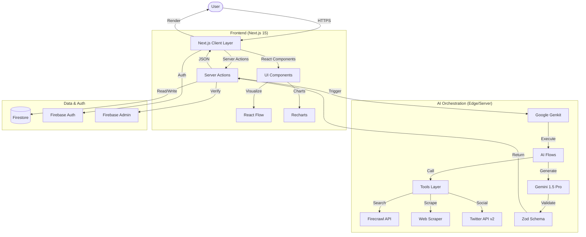
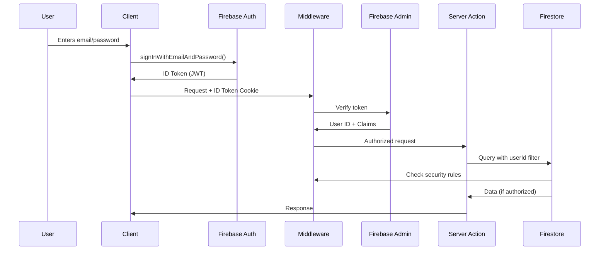

## System Architecture

Argument Cartographer follows a **Modern Monolithic** architecture pattern using Next.js 15, optimized for server-side rendering (SSR) and Edge interactions. This design prioritizes simplicity, security, and performance while maintaining the flexibility to scale.

<Info>
  **Philosophy:** Build monolithic first, extract microservices only when necessary. This keeps the codebase maintainable while allowing future scaling.
</Info>

## Architecture Diagram



## Layer Breakdown

### 1. Client Layer (Frontend)

**Technology:** Next.js 15 App Router, React 18, TypeScript

**Responsibilities:**
- User interface rendering
- Client-side state management
- Visualization rendering (React Flow, Recharts)
- Export functionality (html-to-image)
- Authentication state (Firebase Auth)

**Key Files:**
```
src/app/
  ├── page.tsx                 # Homepage
  ├── dashboard/page.tsx       # Main analysis interface
  ├── radar/page.tsx           # Narrative Radar feed
  └── analysis/[id]/page.tsx   # Individual analysis view

src/components/
  ├── analysis/               # Visualization components
  ├── ui/                     # Shadcn UI primitives
  └── layout/                 # Layout components
```

<Note>
  **Server Components by Default:** Next.js 15 uses React Server Components, reducing client-side JavaScript bundle size.
</Note>

### 2. Intelligence Layer (AI Orchestration)

**Technology:** Google Genkit, Gemini 1.5 Pro, TypeScript

**Responsibilities:**
- AI flow orchestration
- Prompt management
- Tool execution (web search, scraping, social listening)
- Response validation and parsing

**Key Files:**
```
src/ai/
  ├── genkit.ts               # Genkit configuration
  ├── flows/
  │   ├── generate-argument-blueprint.ts
  │   ├── identify-logical-fallacies.ts
  │   ├── summarize-source-text.ts
  │   ├── explain-logical-fallacy.ts
  │   └── ask-more.ts
  └── tools/
      ├── web-search.ts
      ├── web-scraper.ts
      └── twitter-search.ts
```

**Execution Environment:**
- **Development:** Node.js server
- **Production:** Vercel serverless functions (with 60s timeout)

### 3. Data Layer (Backend)

**Technology:** Firebase Firestore, Firebase Auth, Firebase Admin SDK

**Responsibilities:**
- User authentication and session management
- Analysis persistence
- User data isolation
- Security rules enforcement

**Data Structure:**
```
/users/{userId}
  - id, email, displayName, createdAt
  
  /argumentMaps/{mapId}
    - id, userId, input, blueprint, credibilityScore, fallacies, tweets, createdAt
  
  /sources/{sourceId}
    - id, userId, url, content, scrapedAt

/radarTopics/{topicId}
  - id, title, description, blueprint, credibilityScore, createdAt, updatedAt
```

<Warning>
  **Security Model:** All user data is isolated under `/users/{userId}` with path-based authorization. No cross-user data access is allowed.
</Warning>

### 4. External Integration Layer

**Services:**
- **Firecrawl API:** Web search and article scraping
- **Twitter API v2:** Social sentiment analysis
- **Google Gemini:** LLM inference

**Resilience:**
- Graceful degradation if APIs fail
- Fallback strategies (snippets instead of full scrapes)
- Clear error messages to users

## Data Flow

### Complete Analysis Flow

<Steps>
  <Step title="User Submits Topic">
    User enters topic in dashboard, submits form
    
    ```tsx
    <form action={analyzeTopicAction}>
      <input name="topic" />
      <button type="submit">Analyze</button>
    </form>
    ```
  </Step>
  
  <Step title="Server Action Triggered">
    Next.js Server Action executes on server
    
    ```typescript
    export async function analyzeTopicAction(formData: FormData) {
      const topic = formData.get('topic') as string;
      // ... validation
    }
    ```
  </Step>
  
  <Step title="Genkit Flow Invoked">
    Server Action calls Genkit flow
    
    ```typescript
    const result = await generateArgumentBlueprint({ input: topic });
    ```
  </Step>
  
  <Step title="AI Processing">
    Genkit orchestrates:
    - Search query generation (Gemini)
    - Web search (Firecrawl)
    - Article scraping (Firecrawl/custom)
    - Twitter search (Twitter API)
    - Argument analysis (Gemini)
    - Fallacy detection (Gemini)
    - Social pulse generation (Gemini)
  </Step>
  
  <Step title="Schema Validation">
    Result validated with Zod schemas
    
    ```typescript
    GenerateArgumentBlueprintOutputSchema.parse(result);
    ```
  </Step>
  
  <Step title="Firestore Persistence">
    Analysis saved to user's collection
    
    ```typescript
    await addDoc(collection(db, `users/${userId}/argumentMaps`), {
      ...result,
      userId,
      createdAt: serverTimestamp(),
    });
    ```
  </Step>
  
  <Step title="Client Rendering">
    Server Action returns, client re-renders with data
    
    ```tsx
    <AnalysisView analysisData={result} />
    ```
  </Step>
</Steps>

## Scalability Considerations

### Current Capacity

<Tabs>
  <Tab title="Concurrent Users">
    **Estimate:** 100-500 simultaneous analyses
    
    **Bottleneck:** Gemini API rate limits (60 RPM on free tier)
    
    **Mitigation:** Implement queue system, user-level rate limiting
  </Tab>
  
  <Tab title="Data Storage">
    **Current:** Firestore (effectively unlimited)
    
    **Cost:** Scales linearly with usage
    
    **Optimization:** Implement analysis expiration (30-day TTL)
  </Tab>
  
  <Tab title="Edge Function Execution">
    **Limit:** 60-second timeout on Vercel
    
    **Average:** 15-45 seconds per analysis
    
    **Risk:** Complex topics may timeout
    
    **Mitigation:** Implement timeout handling, retry logic
  </Tab>
</Tabs>

### Future Scaling Strategies

<CardGroup cols={2}>
  <Card title="Caching Layer" icon="database">
    Cache common queries, scraped sources, and search results in Redis/Firestore
  </Card>
  
  <Card title="Background Jobs" icon="clock">
    Move analysis to queue (Bull/BullMQ) for async processing
  </Card>
  
  <Card title="CDN for Radar" icon="globe">
    Serve Radar topics via CDN with edge caching
  </Card>
  
  <Card title="Microservices Extraction" icon="cubes">
    Extract scraper and fallacy detection to separate services
  </Card>
</CardGroup>

## Security Architecture

### Authentication Flow



### Security Layers

<Steps>
  <Step title="Client-Side (Firebase Auth)">
    - Email/password authentication
    - Session management via cookies
    - Protected routes via middleware
  </Step>
  
  <Step title="Middleware (next-firebase-auth-edge)">
    - Token verification on every request
    - Redirect unauthenticated users
    - Extract user claims
  </Step>
  
  <Step title="Server-Side (Firebase Admin)">
    - Server Actions verify user identity
    - Database queries filtered by userId
    - No cross-user data exposure
  </Step>
  
  <Step title="Database (Firestore Rules)">
    - Path-based authorization
    - Owner-only read/write
    - No public data enumeration
  </Step>
</Steps>

## Performance Optimization

### Bundle Size Optimization

<CodeGroup>
```json next.config.js
module.exports = {
  compiler: {
    removeConsole: process.env.NODE_ENV === 'production',
  },
  experimental: {
    optimizePackageImports: [
      'lucide-react',
      'recharts',
      '@radix-ui/react-*',
    ],
  },
};
```
</CodeGroup>

**Results:**
- Main bundle: ~120KB gzipped
- First Load JS: 145KB average
- Code splitting per route

### Database Optimization

- **Indexes:** Created on `userId`, `createdAt` for fast queries
- **Composite Indexes:** `(userId, createdAt)` for history views
- **Denormalization:** User data duplicated in analysis docs for fast reads

### Edge Caching

- **Static Pages:** Homepage, marketing pages (CDN cached)
- **Dynamic Pages:** Dashboard, analysis views (no cache)
- **API Routes:** None (all Server Actions)

## Monitoring & Observability

### Planned Implementation

<CardGroup cols={2}>
  <Card title="Error Tracking" icon="bug">
    Sentry for client and server error monitoring
  </Card>
  
  <Card title="Analytics" icon="chart-line">
    Vercel Analytics for performance, PostHog for product analytics
  </Card>
  
  <Card title="Logging" icon="file-text">
    Structured logging with Pino, log aggregation in Datadog/LogRocket
  </Card>
  
  <Card title="Uptime Monitoring" icon="activity">
    UptimeRobot or Pingdom for availability checks
  </Card>
</CardGroup>

## Technology Choices Rationale

<AccordionGroup>
  <Accordion title="Why Next.js 15?">
    - **Server Components:** Reduced JS bundle, better SEO
    - **Server Actions:** Type-safe RPC without API routes
    - **App Router:** Modern routing with layouts
    - **Vercel Deployment:** First-class hosting integration
    - **TypeScript:** Type safety across stack
  </Accordion>
  
  <Accordion title="Why Google Genkit?">
    - **AI-First Framework:** Purpose-built for LLM apps
    - **Tool Support:** Built-in tool calling patterns
    - **Type Safety:** Full TypeScript support
    - **Observability:** Trace logging out of the box
    - **Gemini Integration:** Native Google AI support
  </Accordion>
  
  <Accordion title="Why Firebase?">
    - **Rapid Development:** Auth + DB in one SDK
    - **Security Rules:** Declarative, auditable access control
    - **Real-time:** Live updates (future feature)
    - **Scalability:** Managed service, auto-scaling
    - **Cost:** Free tier generous, pay-as-you-go
  </Accordion>
  
  <Accordion title="Why Firecrawl?">
    - **Quality:** Better than raw scraping libraries
    - **Reliability:** Handles anti-bot measures
    - **Markdown Output:** Clean, parseable content
    - **Rate Limits:** Generous free tier
    - **Search + Scrape:** Combined functionality
  </Accordion>
</AccordionGroup>

## Next Steps

<CardGroup cols={2}>
  <Card title="AI Orchestration" icon="brain" href="/architecture/ai-orchestration">
    Deep dive into Genkit flows and AI architecture
  </Card>
  
  <Card title="Data Layer" icon="database" href="/architecture/data-layer">
    Firestore schema and security rules explained
  </Card>
  
  <Card title="External Integrations" icon="plug" href="/architecture/external-integrations">
    How we integrate Firecrawl, Twitter, and Gemini APIs
  </Card>
  
  <Card title="Installation" icon="download" href="/installation">
    Set up your own instance
  </Card>
</CardGroup>