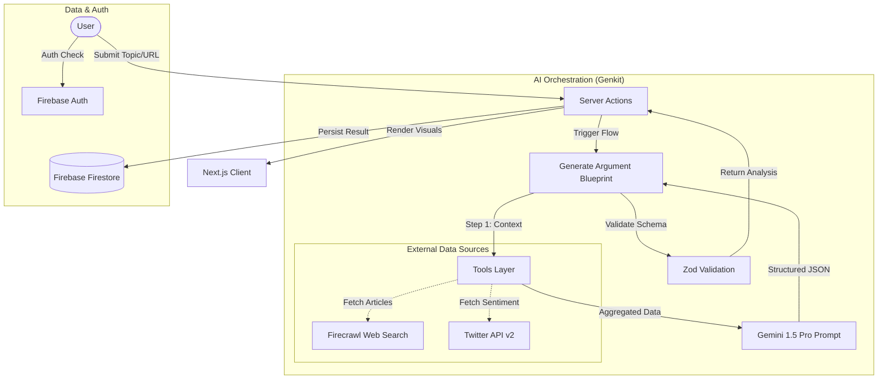

## The Analysis Pipeline

Argument Cartographer employs a sophisticated multi-stage AI pipeline to transform raw text or topics into structured logical blueprints. The entire process is orchestrated by **Google Genkit** and powered by **Gemini 1.5 Pro**, optimized for long-context reasoning.

<Steps>
  <Step title="Input Processing">
    User submits a topic query, URL, or document text for analysis
  </Step>
  <Step title="Search Query Generation">
    AI generates a concise 2-4 word search query capturing the core topic
  </Step>
  <Step title="Multi-Source Data Gathering">
    Parallel fetching from Firecrawl (news) and Twitter (social sentiment)
  </Step>
  <Step title="Context Synthesis">
    Aggregated data (up to 20k tokens) is fed to Gemini for analysis
  </Step>
  <Step title="Argument Decomposition">
    AI identifies thesis, claims, counterclaims, and supporting evidence
  </Step>
  <Step title="Fallacy Detection">
    System scans for logical errors and rhetorical manipulation
  </Step>
  <Step title="Credibility Scoring">
    Algorithm evaluates source quality and argument strength (1-10 scale)
  </Step>
  <Step title="Blueprint Generation">
    Structured JSON output validated via Zod for type safety
  </Step>
</Steps>

## Architecture Diagram



## Stage-by-Stage Breakdown

### 1. Input Processing

When you submit a topic, URL, or text, the system first determines the input type:

- **Topic query** - Example: "Should AI be regulated?"
- **URL** - Example: A news article or blog post
- **Document text** - Pasted content for direct analysis

<CodeGroup>
```typescript Input Schema
const GenerateArgumentBlueprintInputSchema = z.object({
  input: z.string().describe('A topic query, URL, or document to analyze.'),
});
```
</CodeGroup>

### 2. Search Query Generation

The AI analyzes your input and extracts a focused search query optimized for web and social media searches:

<CodeGroup>
```typescript Query Generation
const searchQueryPrompt = ai.definePrompt({
  name: 'searchQueryPrompt',
  input: { schema: z.object({ input: z.string() }) },
  output: { 
    schema: z.object({ 
      searchQuery: z.string().describe(
        "A concise 2-4 word search query representing the core topic"
      ) 
    }) 
  },
  prompt: `Based on the following user input, generate a concise 2-4 word search query...
  
  User Input: {{{input}}}`
});
```
</CodeGroup>

**Example transformations:**
- "What are the arguments for and against universal basic income?" → "universal basic income"
- "https://news.example.com/climate-policy-debate" → "climate policy debate"

### 3. Multi-Source Data Gathering

The system performs parallel searches across multiple sources:

#### Firecrawl Web Search

Fetches articles from **20+ trusted news outlets** including:
- BBC, Reuters, Al Jazeera, CNN, New York Times
- The Hindu, Indian Express, Times of India
- Business Today, Bloomberg, CNBC

<CodeGroup>
```typescript Web Search Implementation
export async function searchWeb(query: string) {
  const siteFilter = TRUSTED_NEWS_OUTLETS.map(s => `site:${s}`).join(' OR ');
  const searchQuery = `${query} (${siteFilter})`;

  const response = await fetch('https://api.firecrawl.dev/v1/search', {
    method: 'POST',
    headers: {
      'Authorization': `Bearer ${firecrawlKey}`,
      'Content-Type': 'application/json'
    },
    body: JSON.stringify({
      query: searchQuery,
      limit: 20,
      lang: 'en',
      scrapeOptions: { formats: ['markdown'] }
    })
  });
  
  // Returns up to 8 diverse sources from unique domains
  return results.slice(0, 20);
}
```
</CodeGroup>

#### Twitter Social Pulse

Searches Twitter/X for recent, relevant public discourse:

<CodeGroup>
```typescript Twitter Search
const searchParams = new URLSearchParams({
  'query': `${input.query} lang:en -is:retweet`,
  'tweet.fields': 'created_at,author_id,public_metrics',
  'expansions': 'author_id',
  'user.fields': 'profile_image_url,username,name',
  'max_results': '20',
  'sort_order': 'relevancy'
});
```
</CodeGroup>

### 4. Context Synthesis

The system aggregates all gathered data into a structured context (up to 20,000 tokens):

```markdown
--- SOURCE 1 ---
URL: https://bbc.com/article
Extracted Text:
[First 12,000 characters of article content]

--- SOURCE 2 ---
URL: https://reuters.com/article
Extracted Text:
[First 12,000 characters of article content]

...
```

<Info>
  The system prioritizes **domain diversity** - selecting articles from different news outlets to avoid echo chambers.
</Info>

### 5. Argument Decomposition

Gemini 1.5 Pro analyzes the context and identifies:

<Tabs>
  <Tab title="Thesis">
    The central contention or question being debated.
    
    **Example:** "Universal Basic Income should be implemented nationwide"
  </Tab>
  <Tab title="Claims (For)">
    Supporting arguments and reasons in favor of the thesis.
    
    **Examples:**
    - "Reduces poverty and inequality"
    - "Provides economic security during automation"
    - "Simplifies welfare bureaucracy"
  </Tab>
  <Tab title="Counterclaims (Against)">
    Objections, rebuttals, and arguments opposing the thesis.
    
    **Examples:**
    - "Too expensive for government budgets"
    - "May disincentivize work"
    - "Inflation risk from increased money supply"
  </Tab>
  <Tab title="Evidence">
    Primary source data, studies, and quotes backing each claim.
    
    **Example:** "Finland's 2017-2018 UBI trial showed 55% reduction in stress levels (Source: OECD Report)"
  </Tab>
</Tabs>

<CodeGroup>
```typescript Argument Node Structure
const ArgumentNodeSchema = z.object({
  id: z.string(),
  parentId: z.string().nullable(),
  type: z.enum(['thesis', 'claim', 'counterclaim', 'evidence']),
  side: z.enum(['for', 'against']),
  content: z.string(),
  sourceText: z.string().describe('Original text snippet from source'),
  source: z.string().describe('URL of source document'),
  fallacies: z.array(z.string()),
  logicalRole: z.string().describe(
    "Node's function in the overall argument"
  ),
});
```
</CodeGroup>

### 6. Fallacy Detection

The AI actively scans source text for logical errors:

<CardGroup cols={2}>
  <Card title="Ad Hominem" icon="user-slash">
    Attacking the person instead of their argument
  </Card>
  <Card title="Straw Man" icon="scarecrow">
    Misrepresenting an opponent's position
  </Card>
  <Card title="False Dichotomy" icon="code-branch">
    Presenting only two options when more exist
  </Card>
  <Card title="Slippery Slope" icon="mountain">
    Assuming a chain reaction without evidence
  </Card>
</CardGroup>

Each detected fallacy includes:

```typescript
interface DetectedFallacy {
  id: string;
  name: string;
  severity: 'Critical' | 'Major' | 'Minor';
  category: string;
  confidence: number; // 0-1
  problematicText: string; // Exact quote
  explanation: string; // Why it's fallacious
  definition: string; // Educational context
  avoidance: string; // How to avoid it
  example: string; // Clean example
  suggestion: string; // Improved phrasing
}
```

### 7. Credibility Scoring

A proprietary algorithm evaluates overall argument quality:

**Scoring factors:**
- **Source diversity** (1-3 points) - Multiple independent sources
- **Evidence strength** (1-3 points) - Primary data vs. opinion
- **Fallacy presence** (-1 to -3 points) - Deductions for logical errors
- **Logical consistency** (1-2 points) - Internal coherence

<Note>
  Scores are intentionally harsh - even well-argued topics rarely score above 8/10. This "brutally honest" approach helps users understand that most debates have legitimate complexity.
</Note>

### 8. Blueprint Generation & Validation

Final output is rigorously validated using **Zod schemas** to ensure type safety:

<CodeGroup>
```typescript Output Schema
const GenerateArgumentBlueprintOutputSchema = z.object({
  blueprint: z.array(ArgumentNodeSchema),
  summary: z.string(),
  analysis: z.string(),
  credibilityScore: z.number().min(1).max(10),
  brutalHonestTake: z.string(),
  keyPoints: z.array(z.string()),
  socialPulse: z.string(),
  tweets: z.array(TweetSchema),
  fallacies: z.array(DetectedFallacySchema).optional(),
});
```
</CodeGroup>

## Real-Time Processing

The entire pipeline completes in **15-45 seconds** depending on:

- Number of sources found (target: 8 diverse articles)
- Twitter API response time
- Gemini processing load

<Tip>
  The system uses **optimistic UI patterns** to show progress: "Searching web...", "Analyzing claims...", "Detecting fallacies..."
</Tip>

## Error Handling & Fallbacks

The system gracefully degrades when external APIs are unavailable:

1. **Primary:** Firecrawl trusted sources + general search
2. **Fallback 1:** Search snippets only (no full scraping)
3. **Fallback 2:** AI knowledge-only mode with clear disclaimer

<Warning>
  When in Fallback 2 mode (API credits depleted), the system clearly indicates that sources could not be verified in real-time.
</Warning>

## Next Steps

<CardGroup cols={2}>
  <Card title="Key Features" icon="star" href="/key-features">
    Explore all platform capabilities
  </Card>
  <Card title="Architecture Deep Dive" icon="sitemap" href="/architecture/ai-orchestration">
    Technical details of the AI orchestration layer
  </Card>
</CardGroup>